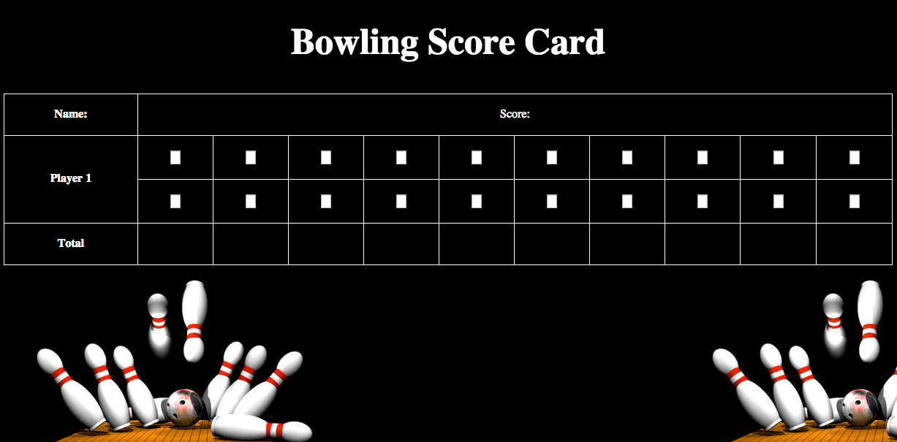

## Objectives of exercise

* HTML
* CSS
* JavaScript
* Testing with Jasmine
* Front-end development
* Test-Driven Development

## Job List

- [x] Create a single page with a scoreboard.
- [x] Create a board with user interaction.
- [ ] User Friendly Experience.
- [ ] Works with bowling rules implamented.

## Technologies used

* Javascript
* Html
* CSS
* Git
* Heroku
* Jasmine

## How to clone this repo

  ```sh
git clone https://github.com/IndiaDearlove/Bowling-ScoreCard.git
 ```
 How to run tests
----
```sh
open SpecRunner.html
```

How to run locally
----

```sh
rackup
```

Visit http://localhost:4567/

## Github profiles of creators

* India - https://github.com/IndiaDearlove

## About

Made during 5th week of Makers Academy. Given the task of creating a bowling score card with Javascript.

## Screen Shots



 
